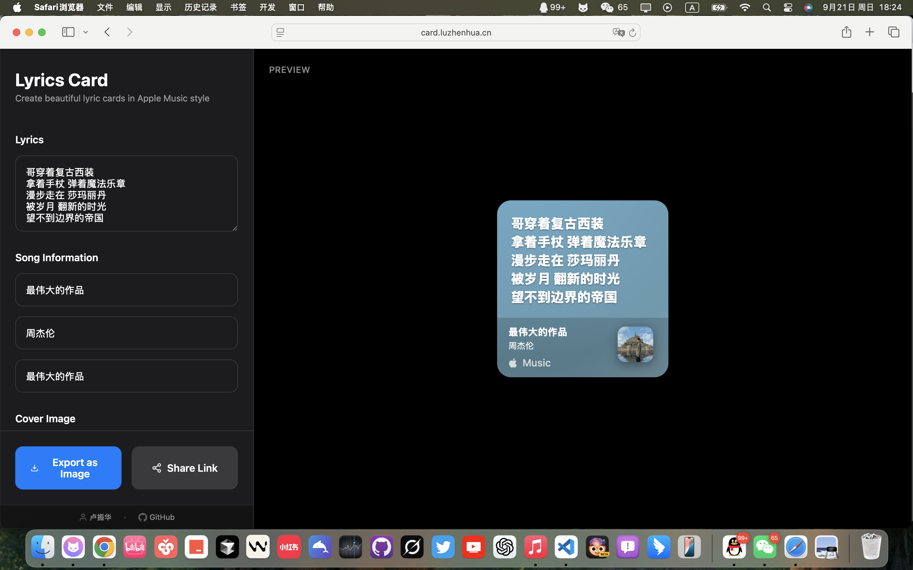

# Lyrics Card Generator

[简体中文](README.md) | [English](README_EN.md)

An Apple Music-style lyrics card generator, inspired by the beautiful card design when sharing lyrics in iMessage.

## 📸 Demo



## ✨ Features

- 🎨 **Apple Music Style Design** - Highly restored Apple Music visual style
- 🌈 **Dynamic Gradient Background** - Support for various color gradients and animations
- 📱 **Responsive Design** - Perfect adaptation for desktop and mobile
- 🖼️ **Album Cover Support** - Upload custom album covers
- 💾 **Multiple Export Formats** - Export as images
- 🔗 **Online Sharing** - Generate share links (requires PHP environment)

## 🚀 Live Demo

Visit: https://card.luzhenhua.cn/

## 📦 Deployment

### Static Deployment (Recommended)
Supports deployment to Vercel, Cloudflare Pages, EdgeOne Pages and other static hosting platforms:

- **Framework Preset**: Other or None
- **Root Directory**: `./`
- **Output Directory**: `.`
- **Build Command**: Leave empty
- **Install Command**: Leave empty

### Full Feature Deployment
For sharing functionality, PHP environment support is required.

## 🛠️ Local Development

```bash
# Clone repository
git clone https://github.com/luzhenhua1/LyricsCard.git

# Enter directory
cd LyricsCard

# Use any HTTP server to run
# For example, Python
python -m http.server 8000

# Or Node.js
npx serve .
```

## 📝 Usage

1. Enter lyrics and song information on the left side
2. Optionally upload album cover image
3. Real-time preview of card effect on the right side
4. Click "Export Image" to save the card

## 🎯 Project Inspiration

When sharing lyrics using Apple Music in iMessage, I found the card design particularly beautiful, which inspired me to create a similar tool. Thanks to ikuncode for providing the Claude Code mirror, making the development process smoother.

## 📄 License

MIT License

## 🤝 Contributing

This is my first open source project, welcome to submit Issues and Pull Requests!

---

If this project helps you, please give it a ⭐️ for support!